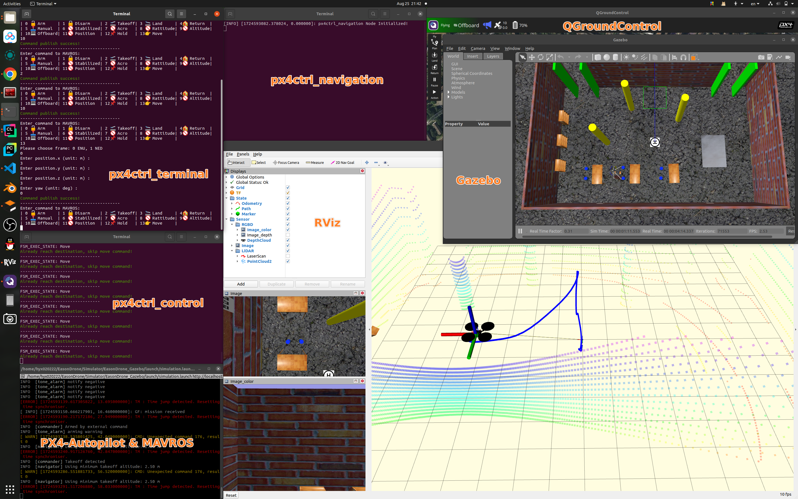

# px4ctrl


A package to control multi-copters using PX4-Autopilot platform. Implement following functions: 

1. Process location data from SLAM, Gazebo, MoCap, etc. Publish to `/mavros/vision_pose/pose`
2. Control drone to `Arm`, `Takeoff`, `Offboard`, `Move`, `Hold`, `Land`, Return, etc. Publish to `/mavros/setpoint_raw/local`
3. Process control command from path-planner, with format `quadrotor_msgs::PositionCommand`
4. Interact with a terminal to control drone, with format `easondrone_msgs::ControlCommand`



Visit this [yuque doc](https://www.yuque.com/g/easonhua/nx9k7f/xuv0pnk5yxk9qw3v/collaborator/join?token=V4SM11MTCXNawO7w&source=doc_collaborator#) for detailed information.

## Installation

```shell
git clone https://github.com/HuaYuXiao/px4ctrl.git ~/easondrone_ws/module/px4ctrl
cd ~/easondrone_ws && catkin_make --source module/px4ctrl --build module/px4ctrl/build
```

## Launch

```shell
roslaunch px4ctrl px4ctrl.launch
```

## Acknowledgement

Thanks for following packages:

- [Prometheus/prometheus_control](https://github.com/amov-lab/Prometheus/Modules/control)
- [XTDrone/control](https://gitee.com/robin_shaun/XTDrone/control)
- [Fast-Drone-250/px4ctrl](https://github.com/ZJU-FAST-Lab/Fast-Drone-250/src/realflight_modules/px4ctrl)

Related docs:

- [mavros wiki](https://wiki.ros.org/mavros)
- [px4 user guide](https://docs.px4.io/master/en/)
